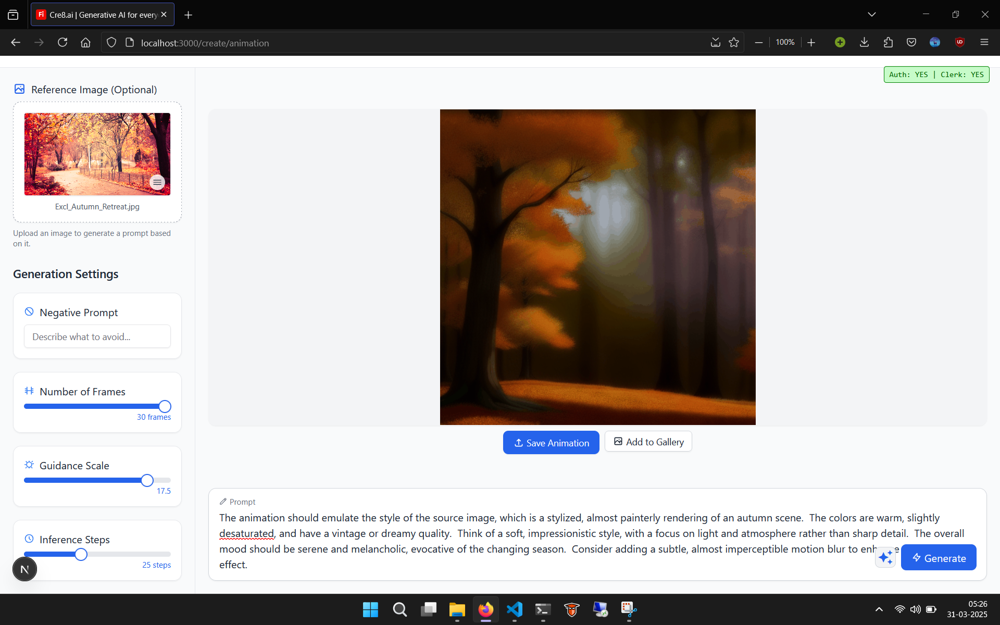

# Cre8.ai

A powerful AI-driven content creation platform built with Next.js.


## Overview

Cre8.ai helps creators, marketers, and businesses generate high-quality content using advanced open-source generative AI models. Our platform streamlines the content creation process while maintaining your unique voice and style.

## Features

- **AI-Powered Content Generation**: Create blog posts, social media content, and more
- **Multiple Content Formats**: Support for text, images, and other media types
- **Customization Options**: Tailor content to match your brand voice
- **User-Friendly Interface**: Intuitive design for creators of all skill levels
- **Export Capabilities**: Download or directly publish your content

## Getting Started

Pre-requisites: Node.js

Install dependencies

```bash
npm install
```

Then, run the development server:

```bash
npm run dev
# or
yarn dev
# or
pnpm dev
# or
bun dev
```

Screenshots



