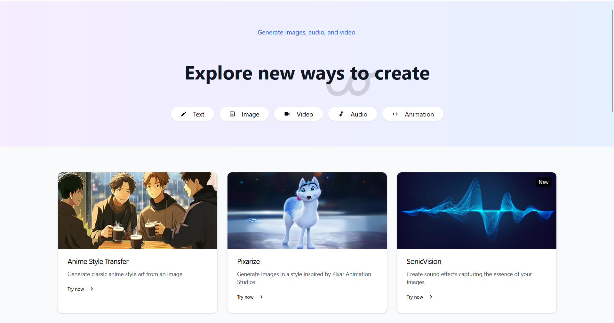
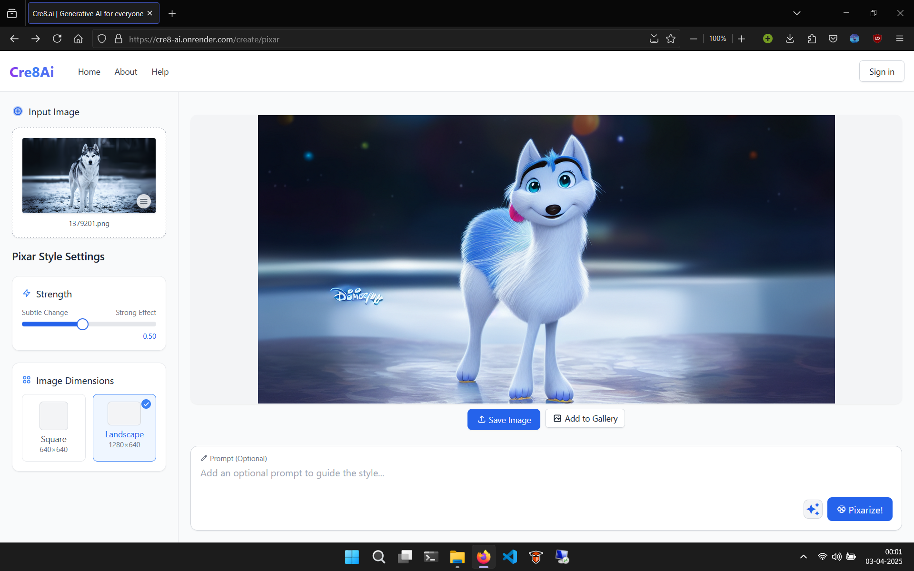

# Cre8.ai

Our studio is now live at: [Cre8.ai](https://cre8-ai.onrender.com)

A powerful AI-driven content creation platform built with Next.js.



## Overview

Cre8.ai helps creators, marketers, and businesses generate high-quality content using advanced open-source generative AI models. Our platform streamlines the content creation process while maintaining your unique voice and style.

## Features

- **AI-Powered Content Generation**: Create blog posts, social media content, and more
- **Multiple Content Formats**: Support for text, images, animations, audio and video
- **Customization Options**: Tailor content to match your needs
- **User-Friendly Interface**: Intuitive design for creators of all skill levels
- **Export Capabilities**: Download your content directly without any restrictions or save them to your personal gallery

## Getting Started

Pre-requisites: Node.js

Install dependencies

```bash
npm install
```

Then, run the development server:

```bash
npm run dev
# or
yarn dev
# or
pnpm dev
# or
bun dev
```

## Screenshots



## Notes

We make use of the following open-source models in our studio:

- MusicGen by Meta for music generation
- Phi-4-Multimodal Instruct by Microsoft for mutliple tasks involving vison and language
- Wan 2.1 by Alibaba for video generation
- Stable Diffusion for image generation
- AnimateDiff for animation generation
- Kokoro for text-to-speech tasks

All models are deployed on Spheron's decentralized compute platform, keeping scalability and efficiency in mind.
